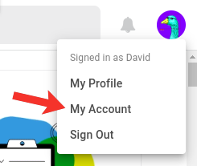
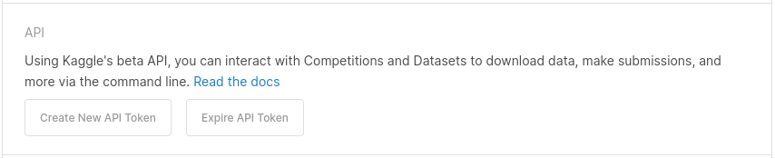
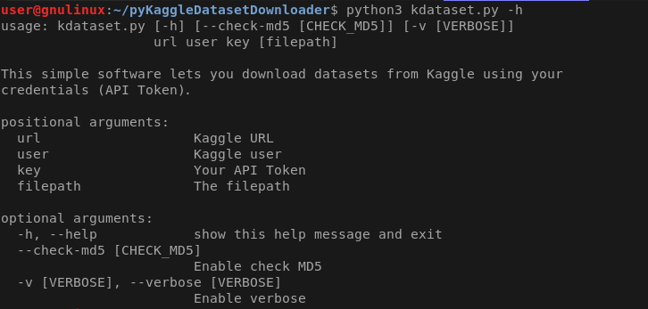

# Kaggle Dataset Downloader

This simple software lets you download datasets from Kaggle using your credentials ([API Token](#how-to-get-api-token)). You just have to give the dataset URL to start downloading it.

Also, you can set the filename and MD5 checking. Pass the URL from the command line or import the module to use in your Python scripts.

## How to get API Token
First, in [Kaggle.com](https://www.kaggle.com/) click on your profile picture, then on "My Account".



Second, on the section API, you have to create an API Token clicking on the button.



[More information](https://www.kaggle.com/docs/api).

A `kaggle.json` file will be downloaded. The file's content is like:

```json
{
    "username": "your_username_here",
    "key": "49c0d2aef0ab2634b0051544cdbf2415"
}
```

These are your data, `username`, and `key`.

## How to use from scripts

The `KaggleDatasetDownloader` class needs your username, key, and the verbose (optional).

```python
from kdataset import KaggleDatasetDownloader

kdd = KaggleDatasetDownloader(
	"username",
	key="49c0d2...bf2415",
	verbose=True)
```

After, you have to use the `download` method. Give it an URL and optionally path, filename, and if you want to check MD5 of the downloaded file.

```python
success = kdd.download(
	"https://www.kaggle.com/username-example/dataset-example",
	path="/tmp",
	filename="downloaded_dataset.zip",
	check_md5=True)

if success:
	print("I'm happy :)")
else:
	print("Delete it :(")
```

## Using in the command line

The help message explains the options of configuration.

